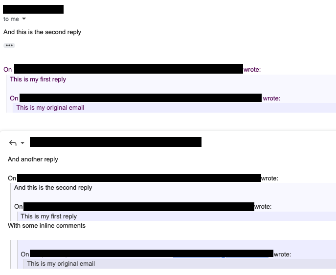

# gmail-high-quote  

A trivial Chrome/Firefox extension that highlights the quoted text in GMail.

It works both when reading email, as well as when editing.

If you want to change colors, just change the `src/ghq.css` file.

## Example

> 

## Installation

Currently, this extension is only available as a source code.

### Chrome installation

* In Chrome, go to [chrome://extensions/]()
* Enable "Developer mode"
* Click "Load unpacked"
* Point to the `src` directory in this tree
* Reload the page
* Done

### Firefox installation

* Open [about:debugging#/runtime/this-firefox]()
* Click "Load Temporary Add-on"
* Select any file in the `src` directory here.

See [here](https://developer.mozilla.org/en-US/docs/Mozilla/Add-ons/WebExtensions/Your_first_WebExtension#installing)
for more options
